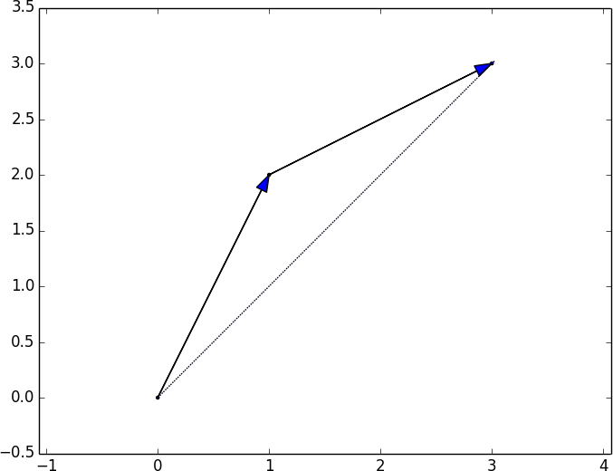

Linear algebra is the branch of mathematics that deals with vector spaces.

# Vectors

Vectors are objects that can be added together, that can be multiplied by an 
scalar.

For us, vectors are points in a finite dimensional space.

Although you might not think of your data as vectors, they are a good way to 
represent numeric data.

For example, if you have heights, weights, and ages of a large number of people,
you can treat your data as three-dimensional vectors (height, weight, age).  

Another example, if you are teaching a class with four exams, you can treat 
student grades as four dimensional vectors (exam1, exam2, exam3, exam4).


The simplest approach is to represent vectors as list of numbers. A list of 
three numbers corresponds to a vector in three-dimensional space.


```python
from typing import List

Vector = List[float]

# Vector of height in cm, weight in kg, age
heigth_weigth_age = [70, 170, 40]

# The grades for each exam, considering that we have 4 exam per year and student
grades = [95, 80, 75, 62]
```

One problem with this approach is that we want to perform arithmetic on vectors.

Python Lists aren't vectors (and hence provide no facilities for vector 
arithmetic), we'll need to build these arithmetic tools ourselves.

## Add Vectors

We'll frequently need to add two vectors. 

Vectors add componentwise, this means that if two vectors 'v' and 'w' are the
same length, their sum is just the vector whose first element is v[0] + w[0], 
whose second element is v[1] + w[1], and so on. Note: if two vectors aren't 
not the same length, we're not allowed to add them.

Example:
Adding the vectors [1, 2] and [2, 1] results in [1 + 2, 2 + 1] => [3, 3] 



We can implement this by:

```python
def add(v: Vector, w: Vector) -> Vector:
    # We cannot sum vectors of different lengths
    if len(v) != len(w):
        raise ValueError("vectors must be the same length")

    # Initialize the output
    output = [0] * len(v)

    # Add Componentwise
    for i in range(len(v)):
        output[i] = v[i] + w[i]

    return output
```

Similarly, to subtract two vectors we just subtract corresponding elements.

We'll sometimes want to componentwise sum a list of vectors. That is, create a 
new vector whose first element is the sum of all the first elements, whose 
second element is the sum of all the second elements, and so on.

```python
def sum_of_vectors(vectors: List[Vector]) -> Vector:

    # All vectors must have the same length, we can compare the length of
    # every vector with the first one (for example)
    all_vector_have_the_same_length = all(
        [len(v) == len(vectors[0]) for v in vectors]
    )
    if not all_vector_have_the_same_length:
        raise ValueError(
            "Not all the vectors in the list have the same length"
        )

    # Initialize the output
    output = [0] * len(vectors[0])

    # Add component wise with all the vectors
    for each_vector in vectors:
        output = add(output, each_vector)

    return output
```

We could even reduce the list of vectors using our function vector_add:

