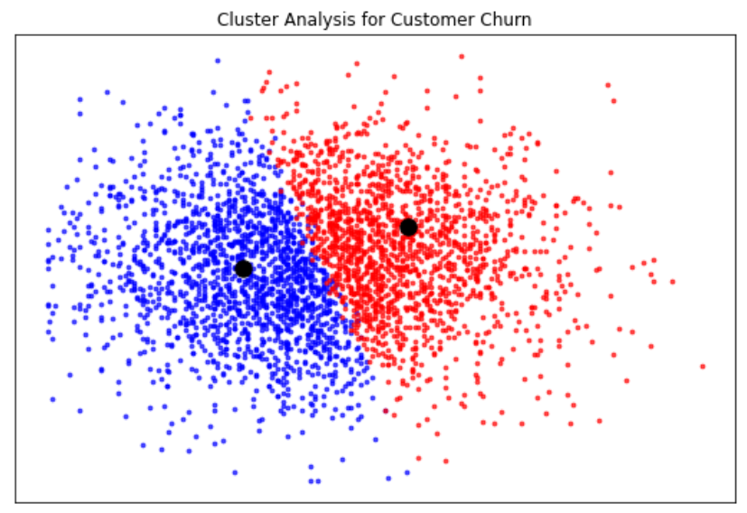
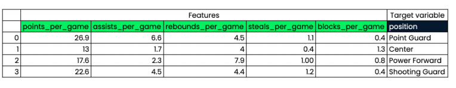

# Machine learning with scikit-learn

In Machine learning computers learn to make decisions from data without 
being explicitly programmed.

Examples: 
- Predicting if an email is spam or not given its content and sender. 
- Learn to cluster books to one exiting cluster based on the words they contain, then assigning any new book to one of the existing clusters.

## Unsupervised Learning
Unsupervised learning is the process of __uncovering hidden patterns 
and structures from unlabeled data__.

### Example: 
A business may wish to __group its customers into distinct categories based 
on their purchasing behavior without knowing in advance what these 
categories are__. This is known as clustering, one branch of unsupervised learning.

## Supervised Learning
Supervised learning is a __type of machine learning where the values to 
be predicted are already known__, and a model is built with the aim of 
accurately predicting values of previously unseen data.

Supervised learning uses features to predict the values of a 
target variable. Such as predicting a basketball player's position based 
on their points per game.

We'll focus on supervised learning for now.

## Types of supervised learning
There are __2 types of supervised learning__:
- __Classification__: used to __predict the label (or category) of an observation__.

	Example: predict whether a bank transaction is fraudulent or not. As there 
    are two outcomes here fraudulent/not fraudulent this is known as 
  	binary classification.   

- __Regression__: used to predict continuous values. 
    Example: a model can use features such as number of bedrooms, ad the size 
    a property, to predict the price of the property.

## Before using supervised learning
1. There are some requirements to satisfy before performing supervised learning. 
   - Our data must __not have missing values__. 
   - Must be in a __numeric format__.

2. Perform some __exploratory analysis first__ to ensure data is in the correct format.
   - Descriptive statistics
   - Data visualizations

# Binary classification

We saw that there are two types of supervised learning: classification and 
regression. Recall that __binary classification__ is used to __predict a 
target variable that has only two labels__, typically represented numerically 
with a zero or a one.

A dataset, `churn_df`, has been preloaded for you.
![[Pasted image 20230913081245.png]]

Your task is to examine the data and choose which column could be the target variable for binary classification.

- [ ] customer_service_calls
- [ ] total_night_charge
-  [X] churn
	 has values of `0` or `1`, so it can be predicted using a binary classification model.
- [ ] account_length

## The classification challenge
Let's discuss how we can build a classification model, or classifier, to predict the labels of unseen data.
- Build a classifier which learns from the labeled data we pass to it.
- Then we pass unlabeled data as input, and have it predict labels for this unseen data.

As the classifier learns from the labeled data, we call this the training data.

https://campus.datacamp.com/courses/supervised-learning-with-scikit-learn/classification-1?ex=4

## K-Nearest Neighbors (KNN)

We'll use an algorithm called K-Nearest Neighbors, which is popular for classification problems. 
The idea of KNN is to predict the label of any data point by looking at the k (example 3) closest labeled data. And guessing them to vote on what label the unlabeled observation should have.

KNN uses majority voting, which makes predictions based on what label the majority of nearest neighbors have. 

Using the following scatter plot. 
![[Pasted image 20230914071544.png]]

How do we classify the black point?
If k = 3, then we would classify it as a red point, this is because 2 of the 3 closest observations are red

![[Pasted image 20230914071644.png]]

if k = 5, we would classify it as blue.
![[Pasted image 20230914072026.png]]

To build some intuition for KNN, let's look at this scatter plot displaying total evening charge against total charge for customers of a telecom company. 
The observations in blue for customers who have churned, and red for customers that have not churned. 

![[Pasted image 20230914072132.png]]

Here, we have visualized the results of a KNN algorithm where the number of neighbors is 15.
![[Pasted image 20230914072619.png]]

KNN creates a decision boundary to predict if customers will churn. So, any customer in the gray area are predicted to churn, and those in the area with a red background are predicted to not churn.

This boundary would be used to make predictions on unseen data. 

Basic exercise using KNN
[github link](https://github.com/spuzi/machine_learning_training/blob/main/knn/knearest_neighbors_fit.py)

