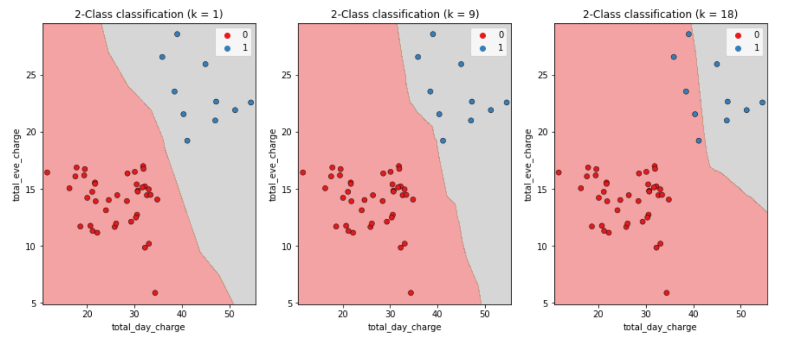
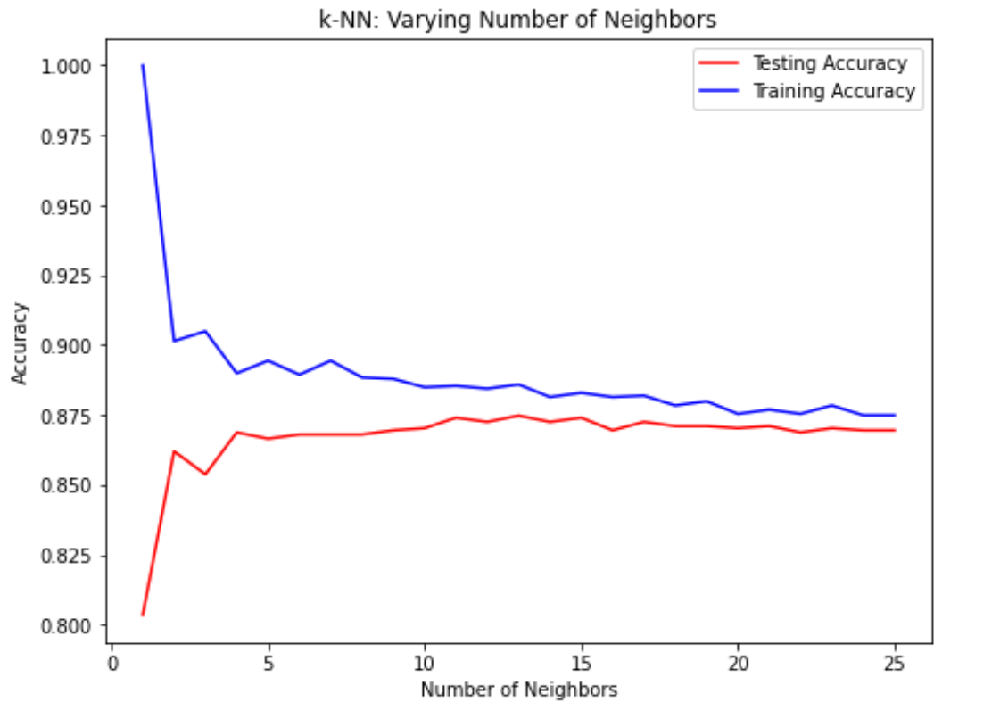
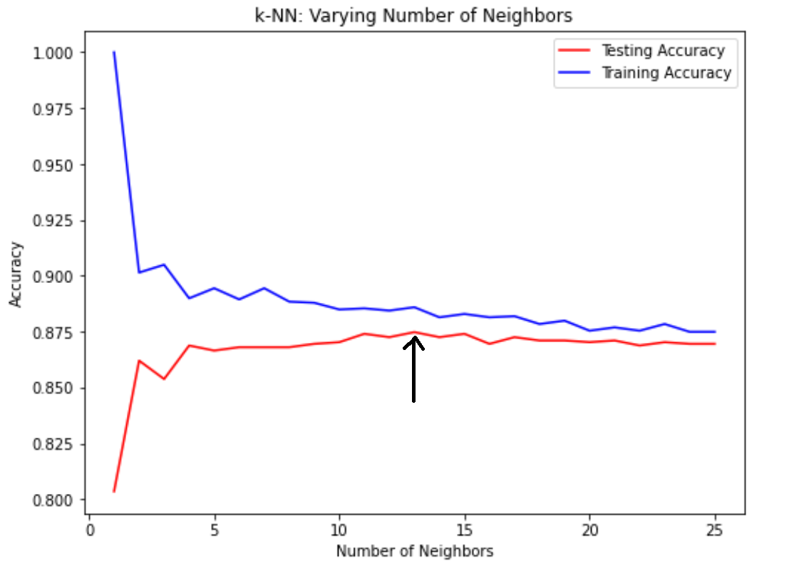

#accuracy #split_train_test #model_complexity #model_complexity_curve
# Index

- Measuring model performance
- Accuracy
- Split data into Train and Test sets
- Model complexity
- Model complexity curve
- Exercises
  - Calculate the score using the test set
  - Model Complexity Curve


## Measuring model performance

Now that we know how to make predictions using a classifier. __How can we know 
if a model is making correct predictions?__
We can __evaluate its performance__.

## Accuracy

__In classification accuracy is a commonly used metric__.

$$accuracy = \frac {correct\ predictions} {total\ observation} $$

__We could compute accuracy on the data used to fit the classifier. However, 
as this data was used to train the model, performance will not be indicative 
of how well it can generalize to unseen data.__

That's why it is common to __split the data into a training set and a test set.__

<h2 id="split_data_into_train_and_test_sets">Split data into Train and Test sets</h2>

The __training set is used to fit the classifier__. And the __test set is used 
to calculate the model's accuracy__ against the test set labels.

```python
from sklearn.model_selection import train_test_split

"""
X: the columns used as features
y: the target column to predict
test_size: the % of data used for the test size
random_state: allow us to reproduce the experiment with the same split
stratify: make sure that the target variable is in the same proportion 
          in both, the train and test sets.
"""
X_train, X_test, y_train, y_test = train_test_split(X, y, 
                                                    test_size=0.3,
                                                    random_state=21,
                                                    stratify=y)
```

It is best practice to __ensure our split reflects the proportion of labels in our data__. 
For example: if churn occurs in 10% of observations, we want 10% of labels 
in our training and test sets to represent churn.

```python
knn = KNeighborsClassifier(n_neighbors=6)
knn.fit(X_train, y_train)
print(knn.score(X_test, y_test))
# 0.88
```


## Model complexity 

Let's discuss how to interpret the hyperparameter K (number of neighbors). Recall that we 
discussed __decision boundaries__, which are __thresholds for determining what label a model 
assigns to an observation__.

__As K increases, the decision boundary is less affected by individual observations, 
reflecting a simpler model__. 



__Simpler models are less able to detect relationships in the dataset__, which is known as __underfitting__. 

In contrast, __complex models can be sensitive to noise in the training data, rather 
than reflecting general trends, this is known as overfitting.__

<h2 id="model_complexity_curve">Model complexity curve</h2>
Se can also interpret K using a model complexity curve, with a KNN model, we can calculate 
accuracy on the training and test sets using incremental K values, and plot the results.

```python 
train_accuracies = {}
test_accuracies = {}

neighbors = np.arrange(1, 26)

for neighbor in neighbors:
	knn = KNeighborsClassifier(n_neighbors=neighbor)
	knn.fit(X_train, y_train)

	# Store the accuracies obtain on the train and test set.
	train_accuracies[neighbor] = knn.score(X_train, y_train)
	test_accuracies[neighbor] = knn.score(X_test, y_test)
```

Now we can plot the different scores achieved using a different value of K. 

```python
plt.figure(figsize=(8,6))
plt.title("KNN: Varying Number of Neighbors")

plt.plot(neighbors, 
		 train_accuracies.values(), 
		 label='Training accuracies')

plt.plot(neighbors, 
		 test_accuracies.values(), 
		 label='Test accuracies')

plt.legend()
plt.xlabel("Number of neighbors")
plt.ylabel("Accuracy")

plt.show()
```

Here's the result:



As K increases beyond 15 we see overfitting where performance plateaus on both test and 
training sets, as indicated in this plot.

The peak test accuracy actually occurs at around 13 neighbors.



## Exercises 

1. [Using KNeighbors for classification](../../../knn/01_knn_train_test_accuracy_comparison.py)
2. [Model Complexity Curve](../../../knn/02_knn_overfitting_underfitting.py)