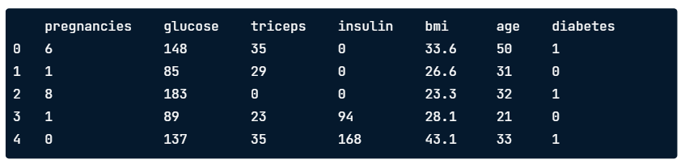
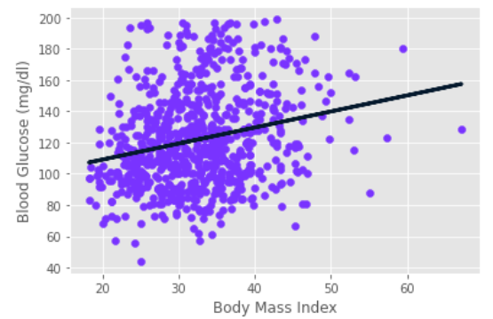
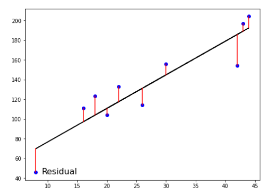
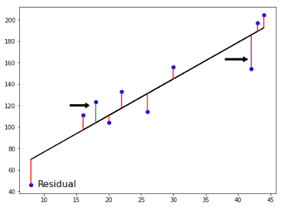
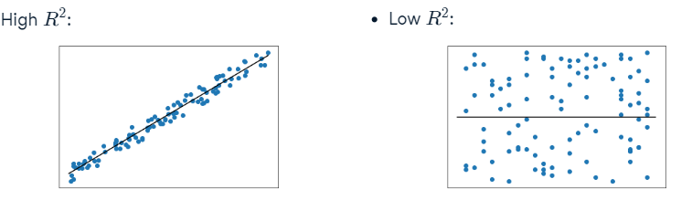

#regression #linear_regression #rss #ols #r2 #mse #rmse 
# Index
- Introduction to Regression
- Fitting a regression model
- Exercise: linear regression with one feature
- Basics of linear regression
- R-squared
- Mean Squared Error and Root Mean Squared Error
- Exercise: measure a linear regression model with RMSE
    


## Introduction to Regression

In regression tasks, the __target variable has continuous values__, such a country's GDP, 
or the price of a house.

For example, we could use a dataset containing health data to predict blood glucose levels.

```python
import pandas as pd

diabetes_df = pd.read_csv('diabetes.csv')
print(diabetes_df.head())
```



```python
X = diabetes_df.drop('diabetes', axis=1).values
y = diabetes_df['diabetes'].values
```

Let's try to predict blood glucose levels from a single feature: "body mass index".
```python
X_bmi = X[:, 3]
X_bmi = X_bmi.reshape(-1, 1)

import matplotlib.pyplot as plt

plt.scatter(X_bmi, y)

plt.ylabel("Blood Glucose (mg/dl)")
plt.xlabel("Body Mass Index")

plt.show()
```


We can see that generally, as body mass increases, blood glucose levels also tend to increase.


<h2 id="fitting_a_regression_model">Fitting a regression model</h2>

Let's fit a regression model to our data. We're going to use a __model called "linear regression", 
which fits a straight line to our data.__

```python
from sklearn.linear_model import LinearRegression

reg = LinearRegression()
reg.fit(X_bmi, y)
predictions = reg.predict(X_bmi)

# Plot the real data
plt.scatter(X_bmi, y)

# Plot the predicted data (it's going to be a line)
plt.plot(X_bmi, predictions)

plt.ylabel("Blood Glucose (mg/dl)")
plt.xlabel("Body Mass Index")

plt.show()
```



The relation between blood glucose and body mass index appear to have a moderate positive correlation.

## Exercise

[Linear regression with one feature](https://github.com/franciscosanchezoliver/machine_learning_training/blob/main/regression/00_linear_regression_with_one_feature.py)

## Basics of linear regression

__We want to fit a line to the data__, and in 2 dimensions this takes the form of:

$$ y = ax + b$$

__Using a single feature is known as '_simple linear regression_'__, 
where __ _y_ is the target, _x_ is the feature and  _a_ and _b_ are the model__ 
parameters that we want to learn.

___a_ and _b_ are also called the 'model coefficients', or a (slope) and b (intercept)__.

To choose values for _a_ and _b_ __we define an error function and then choose 
the parameters that minimize this function__ (line that __minimize the error function__).

__Error functions are also called '_loss or cost functions_'__. 

We want the line to be as close to the observations as possible. Therefore, 
__we want to minimize the vertical distance between the fit and the data__:



The __distance between each point and the line is called '_Residual_'__. 

We could __try to minimize the sum of residuals__ but then each positive residual 
would cancel out each negative residual. 



To avoid this we squared the residuals. By adding all the __squared residuals__, 
__we calculate the sum of squares, or RSS.__

$$ RSS = \sum_{i=1}^{n} (y_i - \hat{y_i})^2  $$

This type of linear regression is called _Ordinary Least Squares (OLS)_ while we're
trying to minimize the RSS. 

When we have 2 features and one target the line will have the following formula:
$$ y = a_1  x_1 + a_2 x_2 + b $$

So, to fit a linear regression model we need to specify 3 variables: 
$$a1, a2, b$$

__When adding more features, it is known as multiple linear regression.__

Fitting a multiple linear regression model means specifying _n_ coefficients 
for a's (one per feature) and one _b_.

Let's perform linear regression to predict blood glucose levels using 
all the features from the diabetes dataset.

```python
from sklearn.model_selection import train_test_split
from sklearn.linear_model import LinearRegression

X_train, X_test, y_train, y_test = train_test_split(X, y,
                                                    test_size=0.3,
                                                    random_state=42)

reg_all = LinearRegression()
reg_all.fit(X_train, y_train)

y_pred = reg_all.predict(X_test, y_test)
```

__Linear regression performs OLS under the hood.__ 

## R-squared

The __default metric for linear regression is R-squared__, which __quantifies the amount 
of variance in the target variable that is explained by the features__.

__Values can range from zero to one__, with __one meaning the features completely explain 
the target's variance__. 

Here we can see how a high and a low value for R-squared looks like:



To compute R-squared:
```python
r_squared = reg_all.score(X_test, y_test)
# 0.53
```

In this case r_squared = 0.35. This means that the features only explain the 35% of 
the blood glucose level variance.


## Mean Squared Error and Root Mean Squared Error

Another way to __assess a regression model's performance__ is to take the __mean of the 
residual sum of squares__, this is known as the ___Mean Squared Error (MSE)___.

$$ MSE = \frac{1}{n} \sum_{i=1}^{n} {(y_i - \hat{y}_i)^2 } = \frac{1}{n} RSS $$

__MSE is measure in squared units of our target variable__. For example if a model is 
prediction a dollar value, MSE will be in dollars squared. __To convert to dollars, we 
can take the squared root__, known as the __Root Mean Squared__.

$$ RMSE = \sqrt{MSE}$$

Example of how calculate _RMSE_:
```python
from sklearn.metrics import mean_squared_error

# To calculate RMSE, we have to use the method 'mean_squared_error' and
# the pass parameter 'squared' to False.
mean_squared_error(y_test, y_pred, squared=False)

print("24.02")
```

This result means that the model has an average error for blood glucose levels 
of around 24 (mg/dl).


## Exercise 
[Example of linear regression and calculate the RMSE](../../../regression/01_multiple_linear_regression.py)
