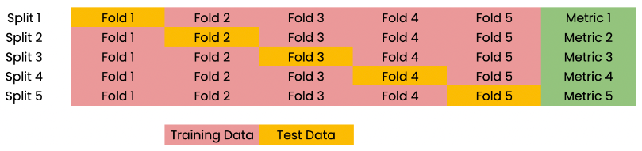

#cross_validation

# Index
- Cross Validation
- Example of cross validation and R-squared

## Cross Validation

We know now how to __split into train and test sets, and computing the model's 
performance on our test set has a potential pitfall for this process.__

If we're computing R-squared on our test set, the __R-squared returned is 
dependent on the way we split up the data.__

The data points in the test set may have some peculiarities that means that 
the R-squared computed on it is not representative of the model's ability 
to generalize to unseen data.

__To combat this dependence, we use a technique called '_Cross Validation_'.__

We begin by __splitting our data into groups or folds__. Then we __set aside the first fold 
as the test set, fit our model on the remaining folds, and predict on our test set__, 
and __compute the metric of interest, such as R-squared__.

Next, we __set aside the second fold as our test set, fits on the remaining data, 
predict on the test set and compute the metric of interest.__ Then similarly with the 
third fold, the fourth fold, and the fifth fold.



As a result we get 5 values of R-squared from which we can compute statistics of interest, 
such as the mean, median, and 95% confidence intervals.

As we split the dataset into 5 folds, we call this process _"5-fold cross validation"_. 

There is, however, a trade-off. Using more folds is more computationally expensive, 
this is because we are fitting and predicting more times.

```python
from sklearn.model_selection import cross_val_score, KFold

kf = KFold(n_splits=6,
           shuffle=True, # Shuffle our datasets before splitting into folds
           random_state=42)

reg = LinearRegression()

# Results after train, predicting and getting the metric of each fold
# Note that the score reported is R squared, as this is the default
# score for linear regression
cv_results = cross_val_score(reg, X, y, cv=kf)

print(cv_results)
# [0.7026, 0.7659, 0.7518, 0.7691, 0.7255, 0.7360]

# We can calculate some statistics on the results obtained
print(np.mean(cv_results), np.std(cv_results))
# 0.7418   0.023

# Additionally we can calculate the 95% confidence interval
# Passing our results followed by a list containing the upper 
# and lower limits of our intervals as decimals.
print(np.quantile(cv_results), [0.025, 0.975])
# 0.7054, 0.7687
```

## Exercise 
[Example of cross validation and R-squared](../../../regression/02_cross_val_for_r_squared.py)

