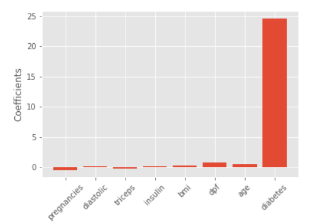

<h2 id="regularized_regression">Regularized Regression</h2>

__Regularized regression is a technique used to avoid overfitting.__

Recall that __fitting a linear regression minimizes a loss function to choose 
a coefficient _a_ (for each feature) and the intercept _b_.__

__If we allow these coefficients to be very large, we can get overfitting__. Therefore, it 
is common practice to __alter the loss function so that it penalizes large coefficients. This 
is called _regularization_.__


<h2 id="ridge_regression">Ridge Regression</h2>

The first type of regularized regression that we'll look at is called _'Ridge'_. With ridge, 
we use the __Ordinary Least Squares (OLS) loss function__.

So we can __calculate the Ridge loss function with the sum of the normal OLS loss function 
and the _normalization_ that is calculated multiplying an alpha to the sum of the 
squared values of each coefficient__.

Plus the squared value of each coefficient, multiplied by a constant, alpha. 

$$Ridge\ loss\ function = OLS\ loss\ function + \alpha * \sum_{i=1}^{n} a_i^2 $$

So, when minimizing the loss function, __models are penalized for coefficients with 
large positive or negative values__.

When using ridge __we need to choose the alpha value in order to fit and predict__.

Essentially, we can __select the alpha for which our model performs best__.

Alpha controls model complexity, __when alpha = 0__ then there is __no normalization__, 
so it is just a OLS function and __this can lead to overfitting__.

A large alpha means that large coefficients are significantly penalized, which can 
lead to underfitting.

```python
from sklearn.linear_model import Ridge

scores = []

# Let's try different values of alpha to see how 
# this affect the outcome of the model.
for alpha in [0.1, 1.0, 10.0, 100.0, 1000.0]:

	# Create a Linear regression with Ridge regularization
	ridge = Ridge(alpha = alpha)

	# Fit the model with the training data
	ridge.fit(X_train, y_train)

	# Predict on the test data
	y_pred = ridge.predict(X_test)

	# Get the scores obtain with the test set in each fold
	score = ridge.score(X_test, y_test)
	scores.append(score)

print(scores)

# We can see how performance get worse as alpha increases.
# [0.2828, 0.2832, 0.2853, 0.2642, 0.1929]
```


<h2 id="lasso_regression">Lasso Regression</h2>

There is another type of regularization called _lasso_, where our loss function is our OLS loss function plus the absolute value of each coefficient multiplied by some constant alpha.
$$Lasso\ loss\ function = OLS\ loss\ function + \alpha * \sum_{i=1}^{n} |{a_i}| $$
```python
from sklearn.linear_model import Lasso

scores = []

# Check the effect of changing the alpha parameter
# for the linear regression with lasso regularization.
for alpha in [0.01, 1.0, 10.0, 20.0, 50.0]:

	# Create a linear regression with lasso regularization
	lasso = Lasso(alpha = alpha)

	# Fit it to to the training set
	lasso.fit(X_train, y_train)

	# Predict with the test set
	y_pred = lasso.predict(X_test)

	# Store the scored obtained
	score = lasso.score(X_test, y_test)
	scores.append(score)

print(score)

# We can see how the numbers drop substantially as alpha goes over 20
# [0.9999, 0.9996,  0.9388, 0.7485, -0.057]
```

__Lasso regression can actually be used to assess feature importance__. 

This is because it tends to __shrink the coefficients of less important features to zero__. 

The features whose coefficients are not shrunk to zero are selected by the lasso algorithm.


```python
from sklearn.linear_model import Lasso

# Selection of the features and target

# We'll try to check what features are relevant in order to 
# predict the blood glucose levels.

# As we are calculating feature importance, we use the entire
# dataset rather than splitting it.
X = diabetes_df.drop("glucose", axis=1).values
y = diabetes_df['glucose'].values

# Get the name of the features used
names = diabetes_df.drop("glucose", axis=1).columns

# We have to use the alpha hyperparameter
lasso = Lasso(alpha=0.1)

# We fit the model to the data and extract the coefficients 
# for each feature.
lasso_coef = lasso.fit(X, y).coef_

# Represent the importance of each feature in a bar plot
plt.bar(names, lasso_coef)

plt.xticks(rotation=45)
plt.show()
```



We can see that the most important predictor for our target variable (blood glucose levels) is the binary value for whether an individual has diabetes or not.

This type of feature selection is very important because it allows us to communicate results to non-technical audiences.

Exercise:
[Exercise](https://github.com/spuzi/machine_learning_training/blob/main/regression/03_linear_regression_with_ridge_regularization.py)
