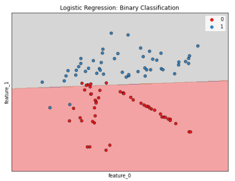

It's time to introduce another model: logistic regression.

Despite his name, logistic regression is used for classification. 

This model calculates the probability (p) that an observation belongs 
to a binary class. 

Using for example a diabetes dataset, if p is more than equal to 0.5, then we label
the data as 1, representing a prediction that an individual is more likely to have
diabetes. 

If p is less than 0.5, then we label it 0, representing that the individual is more 
likely to not have diabetes.

Note that logistic regression produces a linear decision boundary, as we can 
see in this image:



## Code example

We'll use the churn example dataset to use logistic regression.

```python
from sklearn.linear_model import LogisticRegression

# Create a logistic regression model
logreg = LogisticRegression()

# Split our data intro train and test set
X_train, X_test, y_train, y_test = train_test_split(X, y, 
												   test_size=0.3, 
												   random_state=42)

# Fit the logistic regression classifier with the
# training set
logreg.fit(X_train, y_train)

# Predict using the test set
y_pred = logreg.predict(X_test)
```

We can predict probabilities of each instance belonging to a class by  calling logistic
regression's "predict_proba" method and passing the test features:

```python
y_pred_probs = logreg.predict_proba(X_test)[:, 1]

print(y_pred_prob[0])
# [0.0896]
```

This returns a 2-dimensional array with probabilities for both classes. In this case, 
that the individual did not churn, or did churn, respectively. 

We slice the second column representing the positive class probabilities.

Here the models predict a probability of 0.089 that the first observation has churned.


## The ROC curve

By default, the logistic regression threshold is 0.5

This threshold can also apply to other models such as KNN.

So, what happens if we vary this threshold?

We can use a Reciever Operating Characteristic (ROC) to visualize how
different thresholds affect true positive and false positive rates.

![[Pasted image 20231030080454.png]]

Here the dotted line represents a chance model. which randomly guesses labels. 

When the threshold is equal 0, the model predict '1' for all observations, 
meaning it will correctly predict all positive values, and incorrectly predict all 
negative values. 

![[Pasted image 20231030080837.png]]

If the threshold is equal to 1, the model predicts 0 for all observations, 
which means that both true and false positive rates are zero. 
![[Pasted image 20231030081540.png]]

If we vary the threshold, we get a series of different false positive and 
true positive rates. 

![[Pasted image 20231030081619.png]]

A line plot of the threshold helps to visualize the trend

![[Pasted image 20231030082142.png]]

```python
from sklearn.metrics import roc_curve


```

https://campus.datacamp.com/courses/supervised-learning-with-scikit-learn/fine-tuning-your-model-3?ex=4